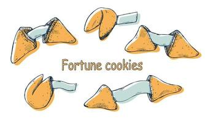
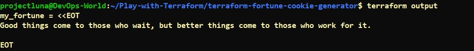

# Terraform Fortune Cookie Generator



This is a fun Terraform project that deploys a Fortune Cookie Generator. It generates random fortune cookie messages and stores them in an output file.

## Prerequisites

Before you begin, ensure you have the following:

- [Terraform](https://www.terraform.io/downloads.html) installed on your computer.
- A text file named `fortune_cookies.txt` with a list of fortune cookie messages, one message per line.

## Getting Started

1. Clone this repository to your local machine:

   ```shell
   git clone https://github.com/your-username/terraform-fortune-cookie.git
   ```

2. Change into the project directory:

   ```shell
   cd terraform-fortune-cookie
   ```

3. Initialize the Terraform project:

   ```shell
   terraform init
   ```

4. Apply the Terraform configuration:

   ```shell
   terraform apply
   ```

   This will generate a random fortune cookie message and store it in the `show_fortune.txt` file.

5. View your fortune:

   ```shell
   cat show_fortune.txt
   ```

6. Here's the output
   


6. To clean up and destroy the resources, run:

   ```shell
   terraform destroy
   ```

## Customizing Fortune Messages

You can customize the fortune cookie messages by editing the `fortune_cookies.txt` file. Add your own messages to make the project more fun and personalized.


## Acknowledgments

- Inspired by the love for fortune cookies and infrastructure as code.

Enjoy your fortunes!
